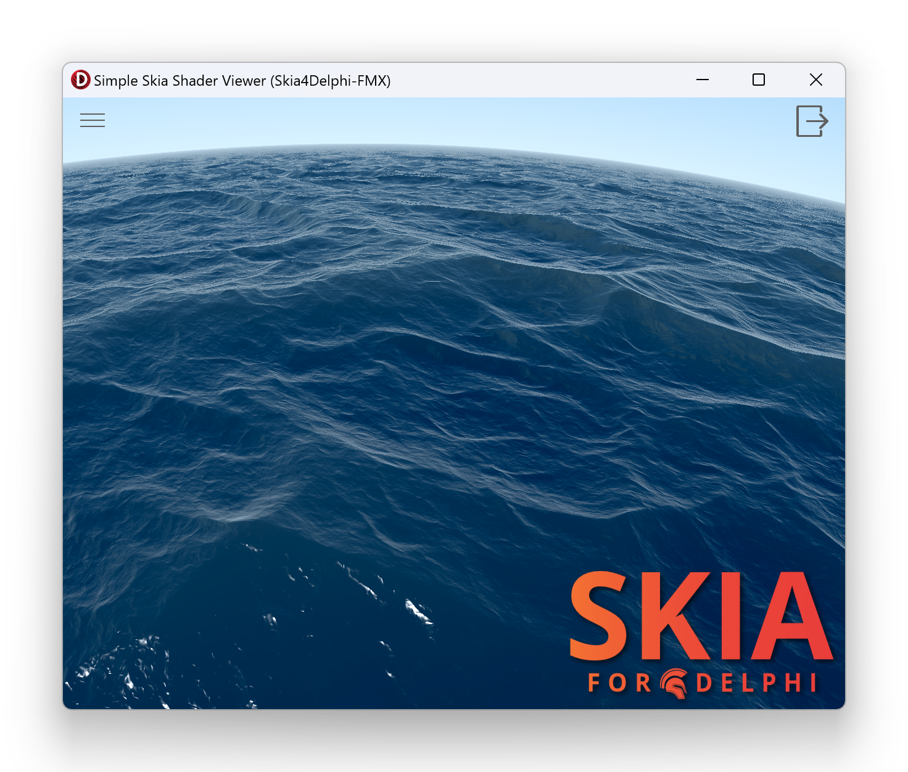

# SkiaSimpleShaderViewer
A simple [Skia Shader Language (SkSL)](https://skia.org/docs/user/sksl/) viewer written in Delphi using [Skia4Delphi](https://github.com/skia4delphi/skia4delphi).
This is a FireMonkey application, so should work on any platform (Windows, MacOS, iOS, Android, and Linux).
Tested on Windows, macOS Arm, macOS x86, and Linux.

Includes a selection of [Shaders](/shaders/) adapted from [ShaderToy](https://www.shadertoy.com/) by
[translating from GLSL to SkSL](SkSL-Overview.md), crediting the original sources. Found in the `/shaders/` folder.

Keyboard shortcuts: `Space` for pause, `Left` & `Right` to cycle, `R` Randomize shader;
Toggles: `?` Help, `F` FPS, `L` Logo, `M` Mouse

[Overview video](https://youtu.be/ZRVpfN70BF8)

Check out the [screenshots](screenshots/readme.md) to preview some different shaders.

Build with [Delphi 11.2 Alexandria](https://www.embarcadero.com/products/delphi) and [Skia4Delphi 4.0](https://github.com/skia4delphi/skia4delphi)
